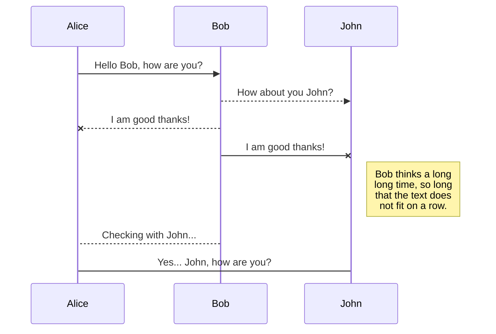

# Jikan Anime/Manga microservice

## Usage

First time

    npm install

Every time

     npm start

The microservice will now be accessible at http://localhost:3000 by default.

### Requesting/Receiving Data

This microservice leverages the Jikan API to return data about a user-supplied anime/manga. Queries are made with the query string `?title=<string>`.

**Endpoints**

`/anime `
`/manga`

**Example Request** (JavaScript Fetch API)

    fetch('http://localhost:3000/anime?title=shingeki-no-kyojin)
      .then(response => response.json())
      .then(data => console.log(data));

**Example Response**:

    data:
    [
        {
            mal_id:  16498,
            title:  "Shingeki no Kyojin",
            title_english:  "Attack on Titan",
            title_japanese:  "進撃の巨人",

    		...
    	}
    ]

## UML Sequence Diagram

